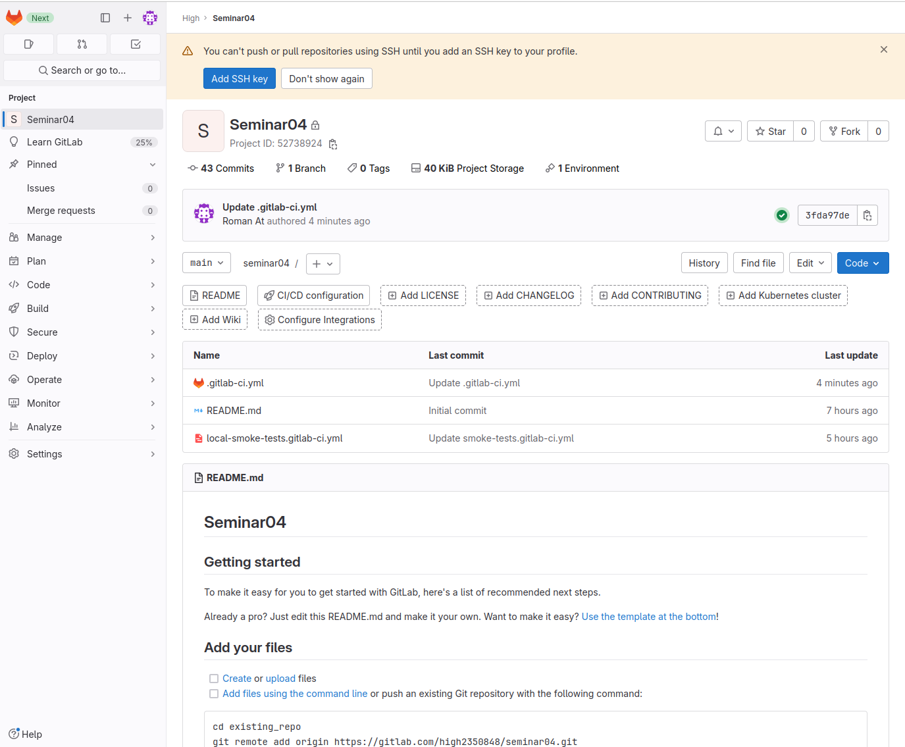
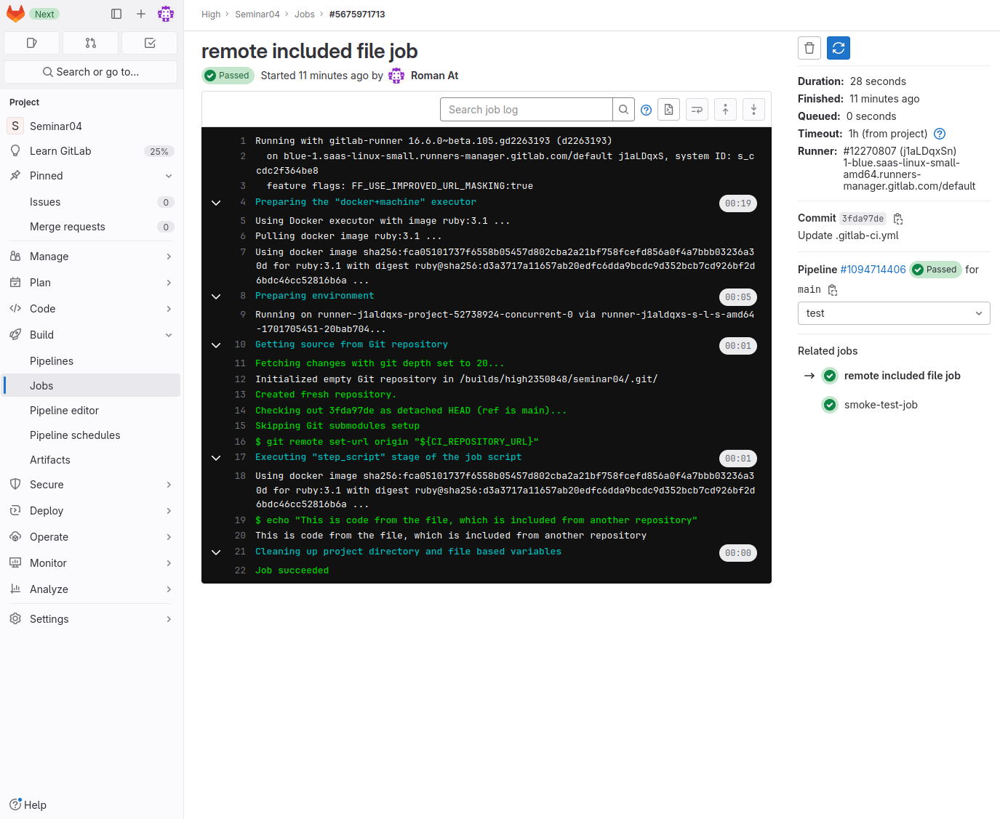
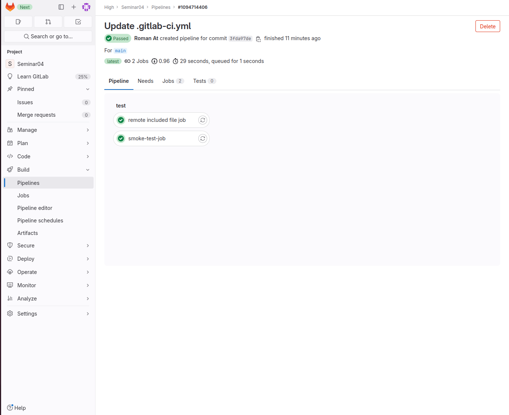

# CI/CD. Семинар 04. Troubleshooting (диагностика и решение проблем в CI/CD)

## Задача
Сделать локальный шаблон CI и отдельный репозиторий с шаблонами, подключить их к своему основному репозиторию через include


## Решение
Создан локальный файл `local-smoke-tests.gitlab-ci.yml`

```yaml
smoke-test-job:
  script: echo "SMOKE"
```

Создан основной файл `.gitlab-ci.yml`

```yaml
include:
  - local: local-smoke-tests.gitlab-ci.yml
# Взял ссылку у Максима Бобкова:
  - remote: https://gitlab.com/ci-cd7655047/5/-/raw/main/remote-included-file.yml
```


Repository Seminar04


Remote included file job


Pipeline passed
